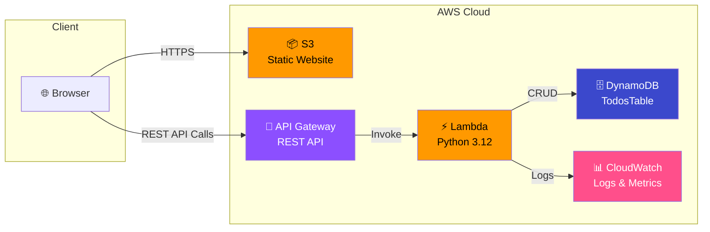

# ☁️ Serverless To-Do List — AWS Cloud Architecture

A production-grade, event-driven to-do list application built entirely on **AWS serverless services**. This project demonstrates proficiency in designing cost-efficient, auto-scaling cloud architectures using Infrastructure as Code.

> **Zero servers to manage. Pay only for what you use. Scales to zero — and to millions.**

---

## 🏗️ Architecture Overview

| Layer | Service | Purpose |
|---|---|---|
| **Frontend** | Amazon S3 (Static Website Hosting) | Serves the SPA (HTML/CSS/JS) globally |
| **API Routing** | Amazon API Gateway (REST) | Routes HTTP requests, handles CORS |
| **Compute** | AWS Lambda (Python 3.12) | Executes CRUD business logic on demand |
| **Database** | Amazon DynamoDB (On-Demand) | NoSQL storage for todo items |
| **Security** | AWS IAM (Least-Privilege) | Scoped policies — Lambda can only access its table |
| **IaC** | AWS SAM / CloudFormation | Reproducible, version-controlled infrastructure |

---

## 🔁 Request Flow

```
1. User visits the S3-hosted web app in their browser
2. User clicks "Add Task" → JavaScript sends POST /todos to API Gateway
3. API Gateway validates the request and triggers the Lambda function
4. Lambda parses the event, generates a UUID, and writes to DynamoDB
5. DynamoDB confirms the write → Lambda returns 201 with the new item
6. API Gateway forwards the response (with CORS headers) back to the browser
7. The frontend updates the UI optimistically with the new task
```

---

## 📐 Architecture Diagram



---

## 📂 Project Structure

```
Serverless-Todo-List/
├── frontend/
│   ├── index.html          # SPA markup
│   ├── style.css           # Dark-mode design system
│   └── app.js              # Vanilla JS — API calls & UI logic
├── lambda/
│   └── app.py              # Lambda handler — CRUD with boto3
├── template.yaml           # AWS SAM / CloudFormation template
└── README.md
```

---

## 🚀 Deployment Instructions

### Prerequisites

- [AWS CLI](https://aws.amazon.com/cli/) configured with credentials
- [AWS SAM CLI](https://docs.aws.amazon.com/serverless-application-model/latest/developerguide/install-sam-cli.html)
- Python 3.12+
- An S3 bucket for frontend hosting

### Step 1 — Deploy the Backend (SAM)

```bash
# Build the SAM application
sam build

# Deploy with guided prompts (first time)
sam deploy --guided

# Subsequent deployments
sam deploy
```

After deployment, SAM outputs the **API Gateway endpoint URL**:

```
Outputs:
  ApiEndpoint: https://abc123xyz.execute-api.us-east-1.amazonaws.com/Prod
```

### Step 2 — Configure the Frontend

Open `frontend/app.js` and replace the placeholder with your API URL:

```javascript
const API_ENDPOINT = "https://abc123xyz.execute-api.us-east-1.amazonaws.com/Prod";
```

### Step 3 — Deploy the Frontend to S3

```bash
# Create an S3 bucket for the website (one time)
aws s3 mb s3://my-todo-app-frontend

# Enable static website hosting
aws s3 website s3://my-todo-app-frontend \
  --index-document index.html

# Sync frontend files
aws s3 sync frontend/ s3://my-todo-app-frontend --delete

# Set public read policy (or use CloudFront for production)
aws s3api put-bucket-policy --bucket my-todo-app-frontend \
  --policy '{
    "Version":"2012-10-17",
    "Statement":[{
      "Sid":"PublicReadGetObject",
      "Effect":"Allow",
      "Principal":"*",
      "Action":"s3:GetObject",
      "Resource":"arn:aws:s3:::my-todo-app-frontend/*"
    }]
  }'
```

Your app is now live at:  
`http://my-todo-app-frontend.s3-website-us-east-1.amazonaws.com`

---

## 🔒 Security Highlights

- **Least-Privilege IAM**: Lambda has `DynamoDBCrudPolicy` scoped only to the `TodosTable` — no wildcard `*` access.
- **CORS Configuration**: API Gateway explicitly declares allowed origins, methods, and headers.
- **No Hardcoded Secrets**: Table name is injected via environment variables from CloudFormation.
- **Input Validation**: Lambda validates request bodies before any database operations.

---

## 💰 Cost Analysis

| Service | Free Tier | Cost After Free Tier |
|---|---|---|
| **Lambda** | 1M requests/month | ~$0.20 per 1M requests |
| **API Gateway** | 1M calls/month | ~$3.50 per 1M calls |
| **DynamoDB** | 25 GB + 25 WCU/RCU | Pay-per-request pricing |
| **S3** | 5 GB storage | ~$0.023/GB/month |

> For a personal project, this architecture typically runs within the **AWS Free Tier** — effectively $0/month.

---

## 🛠️ Tech Stack


---

## 📝 License

This project is open source and available under the [MIT License](LICENSE).

---

<p align="center">
  Built by <strong>Vaibhav Singh</strong> — demonstrating cloud-native architecture with AWS.
</p>
